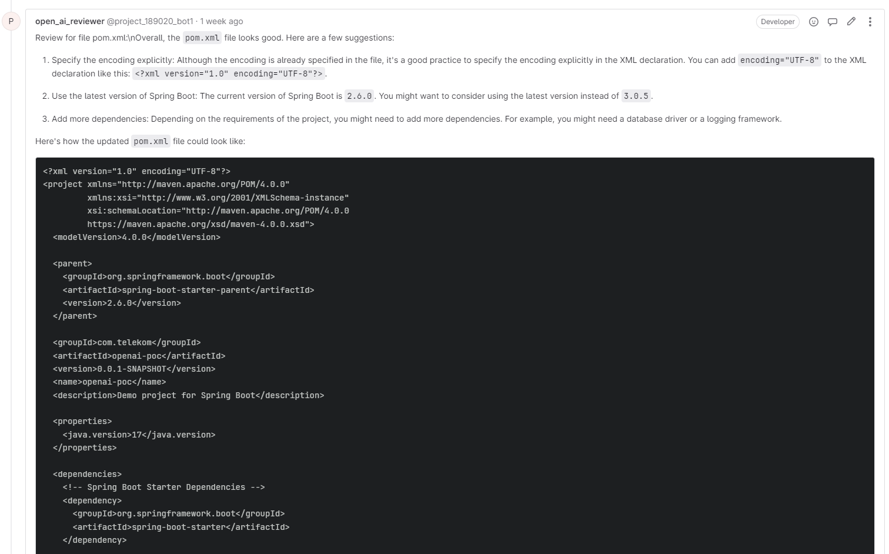

# AI Code Reviewer for GitLab CI/CD
This repository contains a sample .gitlab-ci.yml file that demonstrates how to set up an automatic AI code reviewer using GitLab CI/CD pipelines for merge requests. The AI reviewer helps developers find potential bugs, suggest best practices, and clean code standards. It also provides short examples of how potential changes could look like. This solution can be used with Azure OpenAI deployments as well.

## Sample .gitlab-ci.yml
The provided .gitlab-ci.yml file includes a single stage, lint, which is responsible for performing the AI code review. The script retrieves the changes in a merge request and iterates through the changed files. For each file, it sends the file content to the OpenAI API for evaluation and **adds the AI-generated suggestions as a comment to the merge request**.

## Environment Variables
To use the AI code reviewer, you need to set the following environment variables:

* GITLAB_TOKEN: Your GitLab API private token (e.g., abc123def456).
* GITLAB_API: The base URL of your GitLab API (e.g., https://gitlab.example.com/api/v4).
* OPENAI_API_KEY: Your Azure OpenAI API key (e.g., ghi789jkl012).
* OPENAI_ENDPOINT: The Azure OpenAI endpoint (e.g., https://<YOUR_RESOURCE_GROUP>.openai.azure.com/openai/deployments/<YOUR_MODEL_NAME>/chat/completions => this is a link for Azure deployment. The link will look defferently if you are using your OpenAI account). For example in **Azure**, you can find the link in the _Azure OpenAI Studio_ in _Chat_ tab and then press _View code_. As for direct **OpenAI** links, same example code with API links can be found for example here: https://platform.openai.com/playground?mode=chat
* OPENAI_API_VERSION: The Azure OpenAI API version (e.g., 2023-03-15-preview).
## Usage
1. Add the provided .gitlab-ci.yml file to your GitLab repository.
2. Configure the required environment variables in your GitLab CI/CD settings.
3. Create a merge request with changes in your code.
4. The pipeline will automatically run the AI code reviewer and add suggestions as comments to the merge request.
## Azure OpenAI Deployment
This solution can be used with Azure OpenAI deployments as well. To do so, ensure you have configured the OPENAI_API_KEY and OPENAI_ENDPOINT environment variables with your Azure OpenAI account's API key and endpoint, respectively.
